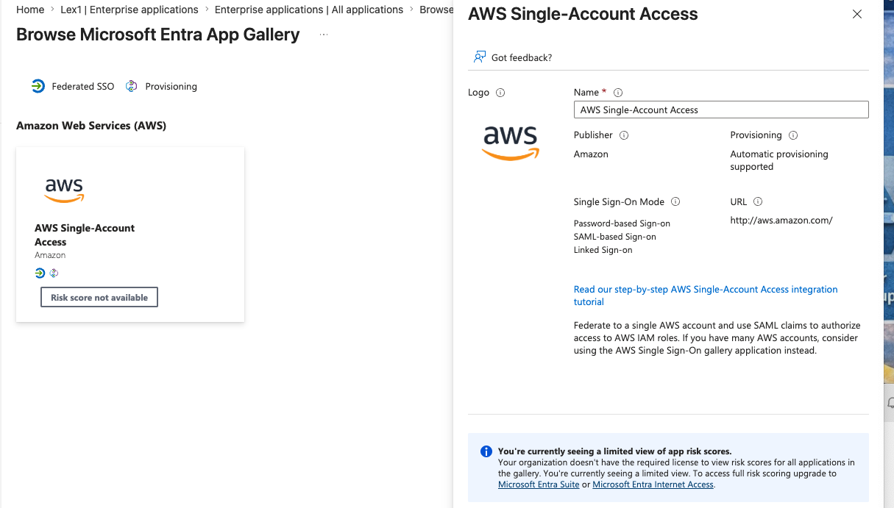
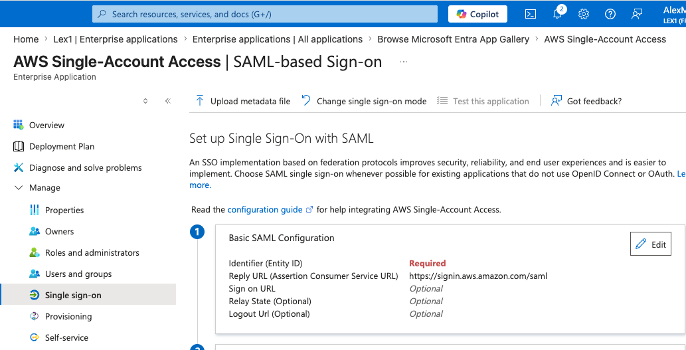
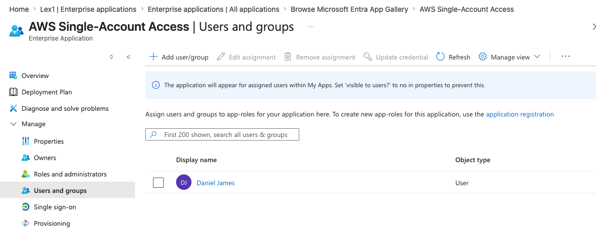

# AWS SSO Integration with Microsoft Entra ID

## 🔐 Overview
This project demonstrates how to configure Single Sign-On (SSO) between Microsoft Entra ID (Azure AD) and AWS using SAML-based authentication.

The goal is to enable secure, centralized identity management where users authenticate once and gain access to AWS resources without managing separate credentials.

---

## 🎯 Objectives
- Configure SAML-based SSO in Microsoft Entra ID
- Integrate AWS as an enterprise application
- Assign users/groups to AWS access
- Demonstrate secure authentication flow using SSO

---

## 🧠 Key Concepts Demonstrated
- Single Sign-On (SSO)
- SAML (Security Assertion Markup Language)
- Identity Federation (Entra ID → AWS)
- Centralized Identity Management

---

## ⚙️ Implementation Steps

### 1. Add AWS Enterprise Application
- Navigated to Microsoft Entra ID
- Selected **Enterprise Applications**
- Added **AWS Single-Account Access**

- ### AWS Application Added in Entra ID

---

### 2. Configure SAML SSO
- Enabled **SAML-based Sign-On**
- Configured:
  - Identifier (Entity ID)
  - Reply URL (ACS URL)
- Established trust between Entra ID and AWS

---

### 3. Assign Users and Groups
- Assigned users to the AWS application
- Ensured proper access control via Entra ID

---

## 🔄 Authentication Flow
User → Entra ID → SAML Token → AWS → Access Granted

---

## ✅ Key Takeaways
- SSO reduces password fatigue and improves security
- SAML enables secure identity federation
- Centralized IAM simplifies access management
- Entra ID can control access to external platforms like AWS

---

## 🛠️ Tools Used
- Microsoft Entra ID (Azure AD)
- AWS IAM
- SAML 2.0
